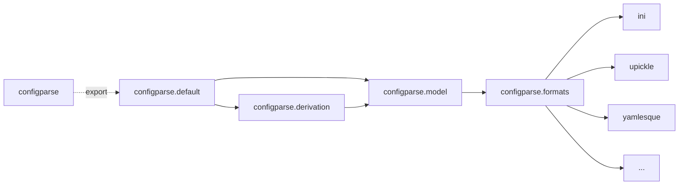

# configparse

Read configuration from multiple formats, and map it to scala types.

## Usage example

1. Define your config model in Scala

    ```scala
    case class ServerConfig(
      basePath: String = "/"
      listen: Seq[ListenConfig]
    ) derives configparse.Reader
    case class ListenConfig(
      address: String,
      port: Int
    ) derives configparse.Reader
    ```

2. Your config file (can be YAML, JSON, INI, or more as described below)

    ```yaml
    base_path: /foo/bar
    listen:
    - address: localhost
      port: 443
    - address: localhost
      port: 80
    ```

3. Read your config file to an instance of the config model

   ```scala
   val config: ServerConfig = configparse.read[ServerConfig](
     paths = Seq("/path/to/config.yaml")
   )
   println(config)
   ```

## Config formats

The following formats are provided out-of-the-box:

- YAML (via https://github.com/jodersky/yamlesque)
- INI (built-in parser)
- JSON (via https://github.com/com-lihaoyi/upickle)
- HOCON (aka the typesafe/lightbend config library)
- JVM system properties
- env vars
- arguments

A user can also define their own formats, by implementing a custom
`configparse.formats.FormatReader`.

## Internals

### Package dependencies

The library is structured around the following packages, with roughly the
following dependencies (utils and helpers omitted):



- `configparse.formats`: abstractions and implementation of various
  configuration formats. These mainly wrap existing libraries to parse text into
  instances of `configparse.model.Config`.

- `configparse.derivation`: functionality to map `Config`s onto scala types
